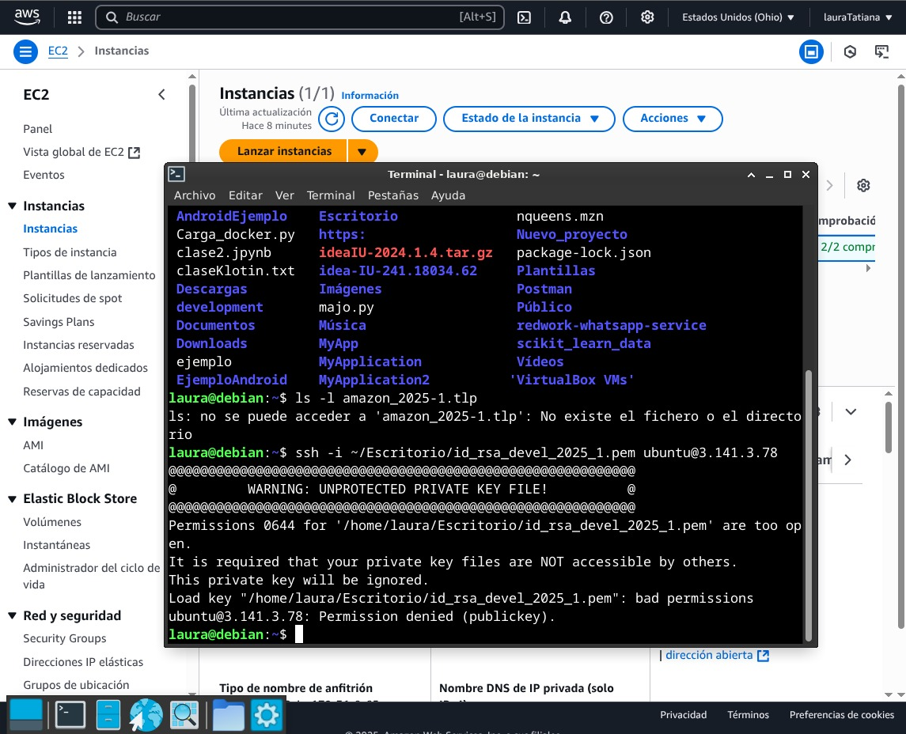

## Creación de cuenta en Amazon Web Services (AWS)

En esta etapa del proyecto se creó una cuenta gratuita en **Amazon Web Services (AWS)** y se configuró una instancia EC2 dentro del nivel gratuito (*Free Tier*). Esta instancia se usó como servidor para futuras pruebas y despliegues.

---

## Lanzamiento de una instancia EC2

Se eligió una instancia tipo `t2.micro`, incluida en el Free Tier. Se configuraron los puertos necesarios y se descargó la llave `.pem` para la conexión remota.

---

## Conexión SSH a la instancia

Una vez lanzada la instancia, se estableció una conexión vía **SSH** desde el terminal local utilizando la llave privada. Esto permitió acceder al servidor como si fuera una máquina propia.

```bash
ssh -i "llave.pem" ubuntu@<ip-pública>
```
---

## Resultado

Ya con la instancia activa y la conexión establecida, se encuentra lista para instalar servicios, hacer pruebas o desplegar aplicaciones desde el entorno remoto.


---


---


---


---


---


---



---


---


